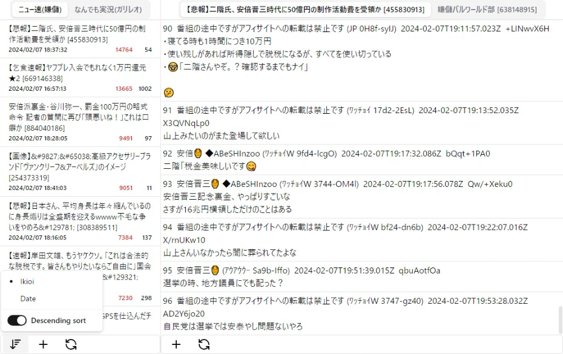

# 2ch.js
[](https://badge.fury.io/js/2ch.js)

ウェブブラウザで動作する2ch互換掲示板ビューア/DATパーサー



## Features / 機能
- タブの永続化
- 勢い・日付ソート
- NGワード (本文のみ)

## ToDo
- [ ] スレタイ・レスの検索機能

## Deploy / デプロイ
```bash
## Cloudflare Workers
$ npm run deploy:worker

## Cloudflare Pages
$ npm run deploy:pages

## Bun (Generate executable file)
## https://bun.sh/docs/bundler/executables
$ npm run build:bun
$ NODE_ENV=production ./dist/run
## And open http://localhost:3000
```

## Author
[Shinosaki](https://shinosaki.com)

## UI
React & shadcn/ui

## License
[MIT](./LICENSE)
